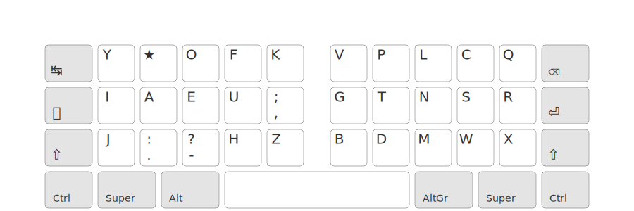
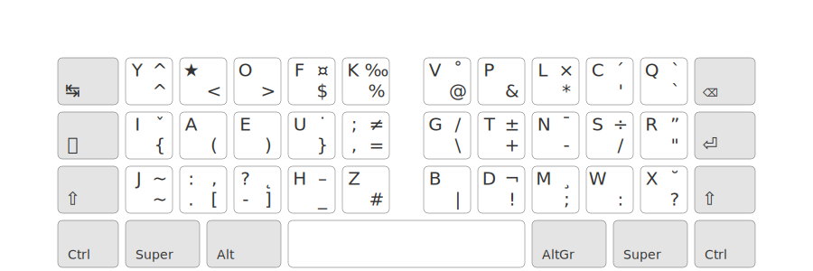

# Erglace

A layout for French, English and programming. It is a fork of [ErgEAU][ergeau], initially adapted for compact keyboards compatibility. It uses many conventions of [Ergo-L][ergol].

[ergeau]: https://github.com/IgrecL/ErgEAU
[ergol]: https://ergol.org

## Features

- a keyboard layout optimized for French and English
- uses a dead key for the most frequent accented characters
- uses the AltGr layer for programming symbols
- fits on 30 keys for compact keyboards compatibility
- trades easy access to common shortcuts for full optimization
- lower SFB than most previous French layouts
- few redirects, at the cost of few rolls

## Links

- [Test the layout][test]
- [Learn the layout][learn]
- [Design notes](NOTES.md)
- [Statistics][stats]
- [Discord (Ergo-L)][discord]

[test]: https://ergol.org/stats#/erglace/ol40/en+fr
[learn]: https://ergol.org/dactylo#erglace
[discord]: https://discord.gg/RH34GjQEgC
[stats]: https://ergol.org/stats#/erglace/ol40/en+fr

## Layout

The dead key ★ gives access to all accented letters you’ll need to write in proper French:

The AltGr layer, taken from [Ergo-L][ergol], is fully dedicated to programming symbols:

Here are additional images with [all the layers](img/erglace_all.svg) or for the [ISO layout](img/erglace_iso.svg) ([1DK](img/erglace_iso_1dk.svg), [AltGr](img/erglace_iso_altgr.svg), [All](img/erglace_iso_all.svg)).

## Comparison to Ergo-L

> Erglace abandonne l'accès facile au raccourcis usuels (Ctrl+C, Ctrl+V, ...) pour atteindre de meilleurs statistiques, en particulier un SFB plus bas, sous les 1%. Le SFB correspond aux enchaînements de deux caractères qui utilisent le même doigt, ce qui ralentit la vitesse de frappe.
>
> L'autre différence est qu'Erglace cherche à minimiser les redirections, c'est-à-dire les enchaînements de trois caractères d'une même main avec un changement de direction, mouvement considéré comme inconfortable. Pour ce faire, toutes les voyelles se retrouvent d'un côté, comme en Bépo, ce qui favorise l'alternance des mains. Le désavantage est que la disposition a moins de roulements, c'est-à-dire des enchaînements de trois lettres d'une main dans une même direction, qui sont appréciables.

## Install

Get the latest driver for your system from the [release section][releases]. See the documentation of [Kalamine][kalamine-layout] to learn how to use it.

On Linux, you can use `xkalamine` to install it. Follow the steps from the [Ergo-L repository][ergol-install] using `erglace.toml` from the [release section][releases].

[releases]: https://github.com/Lysquid/Erglace/releases
[kalamine-layout]: https://github.com/OneDeadKey/kalamine#using-distributable-layouts
[ergol-install]: https://github.com/Nuclear-Squid/ergol#install-linux-only

## Make your own

You can easily modify [the layout](erglace.toml), which is a human-readable ASCII art. Then, use [Kalamine][kalamine] to generate the drivers. Let's find the best layout!

[kalamine]: https://github.com/OneDeadKey/kalamine
